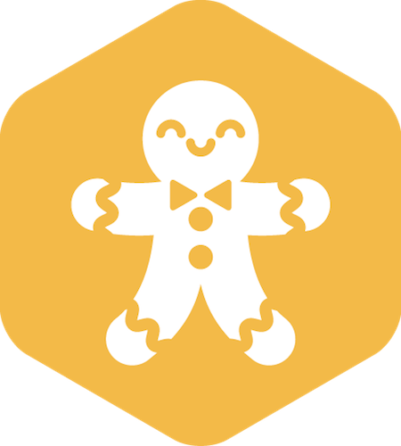

# Cookies plugin for Craft CMS 3.x

A simple plugin for setting and getting cookies from within [Craft CMS](http://craftcms.com) templates.

Related: [Cookies for Craft 2.x](https://github.com/nystudio107/cookies)

This plugin is inspired the [Lj_cookies](https://github.com/lewisjenkins/craft-lj-cookies) plugin, and functions similarly, but adds the ability to get and set secure cookies using the craft->security() framework, and it also provides Twig filters and functions as well as Craft variables for setting & getting cookies.

## Requirements

This plugin requires Craft CMS 3.0.0-RC1 or later.

**Installation**

1. Install with Composer via `composer require nystudio107/craft3-cookies` from your project directory
2. Install plugin in the Craft Control Panel under Settings > Plugins

## Setting cookies

All three of these methods accomplish the same thing:

    {# Set the cookie using 'setCookie' function #}
    {{ setCookie( NAME, VALUE, DURATION, PATH, DOMAIN, SECURE, HTTPONLY) }}

    {# Set the cookie using 'setCookie' filter #}
    {{ NAME | setCookie( VALUE, DURATION, PATH, DOMAIN, SECURE, HTTPONLY) }}

    {# Set the cookie using 'set' variable #}
    

They all act as a wrapper for the PHP `setcookie` function:

More info: (http://php.net/manual/en/function.setcookie.php)

All of the parameters except for `NAME` are optional.  The `PATH` defaults to `/` if not specified

**Examples**

    {{ setCookie('marvin', 'martian', now | date_modify("+1 hour").timestamp ) }}
    {# Sets a cookie to expire in an hour. #}

    
    {# Sets a cookie to expire in 30 days. #}

    
    {# Cookie available within /foo/ directory and sub-directories. #}

## Setting Secure cookies

All three of these methods accomplish the same thing:

    {# Set the cookie using 'setSecureCookie' function #}
    {{ setSecureCookie( NAME, VALUE, DURATION, PATH, DOMAIN, SECURE, HTTPONLY) }}

    {# Set the cookie using 'setSecureCookie' filter #}
    {{ NAME | setSecureCookie( VALUE, DURATION, PATH, DOMAIN, SECURE, HTTPONLY) }}

    {# Set the cookie using 'setSecure' variable #}
    

This function works the same as `setCookie` but instead of using the PHP `setcookie` function, it uses the `craft()->request->getCookies()->add` to add the cookies via Craft.  It also utilizes `craft->security` framework to encrypt and validate the cookie contents between requests.

All of the parameters except for `NAME` are optional.  The `PATH` defaults to `/` if not specified

**Examples**

    {{ setSecureCookie('marvin', 'martian', now | date_modify("+1 hour").timestamp ) }}
    {# Sets a cookie to expire in an hour. #}

    {{ 'marvin' | setSecureCookie('martian', now | date_modify("+30 days").timestamp ) }}
    {# Sets a cookie to expire in 30 days. #}

    
    {# Cookie available within /foo/ directory and sub-directories. #}

## Retrieving cookies

Both of these methods accomplish the same thing:

    {# Get the cookie using 'getCookie' function #}
    {{ getCookie( NAME ) }}

    {# Get the cookie using 'get' variable #}
    

**Example**

    {{ getCookie('marvin') }}
    {# Get the cookie using 'getCookie' function #}

    {{ craft.cookies.get('marvin') }}
    {# Get the cookie using 'get' variable #}

    
        
        {{ myCookie }}
    

## Retrieving Secure cookies

Both of these methods accomplish the same thing:

    {# Get the cookie using 'getSecureCookie' function #}
    {{ getSecureCookie( NAME ) }}

    {# Get the cookie using 'getSecure' variable #}
    

**Example**

    {{ getSecureCookie('marvin') }}
    {# Get the cookie using 'getSecureCookie' function #}

    {{ craft.cookies.getSecure('marvin') }}
    {# Get the cookie using 'getSecure' variable #}

    
        
        {{ myCookie }}
    

This function works the same as `getCookie` but it uses `craft()->request->getCookie()` to retrieve the cookies via Craft.  It also utilizes `craft->security` framework to decrypt and validate the cookie contents between requests.

**Example**

    {{ getSecureCookie('marvin') }}
    {# Get the cookie using 'getSecureCookie' function #}

    {{ craft.cookies.getSecure('marvin') }}
    {# Get the cookie using 'getSecure' variable #}

    
        
        {{ myCookie }}
    

## Deleting cookies

All three of these methods accomplish the same thing:

    {# Delete a cookie by passing no VALUE to 'setCookie' function #}
    {{ setCookie( NAME ) }}

    {# Delete a cookie by passing no VALUE to 'setCookie' filter #}
    {{ NAME | setCookie() }}

    {# Delete a cookie by passing no VALUE to 'set' variable #}
    

## Deleting Secure cookies

All three of these methods accomplish the same thing:

    {# Delete a cookie by passing no VALUE to 'setSecureCookie' function #}
    {{ setSecureCookie( NAME ) }}

    {# Delete a cookie by passing no VALUE to 'setSecureCookie' filter #}
    {{ NAME | setSecureCookie() }}

    {# Delete a cookie by passing no VALUE to 'setSecure' variable #}
    

Brought to you by [nystudio107](http://nystudio107.com)